# Calm down

Welcome to my first project, the calm down website is a landing page for people how are motivated to start meditating. It offers motivation and reasons why to start meditating, a few easy meditation techniques and further links to further sources to intensify meditation. The content is based on the book 'Search Inside Yourself'.

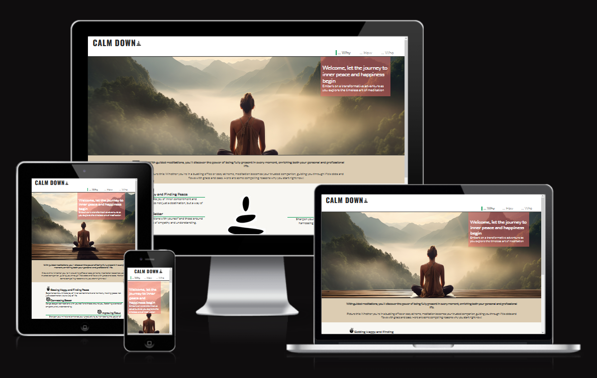

## Features

### Navigation

The user is able to navigate on the navigation bar. There are three navigation elements according to the three pages Why, How, Who. Due to responsive design requiremets the behaviour and position of the navigation bar is slightly different.
To keep the complexity low and due to the fact that the menu elements are short, there is no toggle function for the mobile view.

Mobile view: Elements are aligned to the center. No toggle used. The width of the navigation is so small (~300px) that the content is not covered from the navigation once the screen gets smaller for mobile view. 

Tablet view: Logo on the left site, navigation elements on the right site.

Desktop view: Logo on the left site, navigation elements on the right site. However effect is implemented. 

There are three media query breakpoints used: (320px), 768px, 992px

#### Desktop view
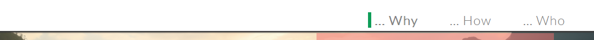

#### Tablet view
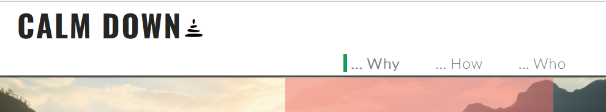

#### Mobile view
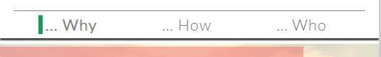

### The header 
Title and logo are above the navigation. Depending on the media query the header gets bigger. The font-size/size of title and logo increases. The header's height is around 97px, therefore. there is a margin-top value of 97px for the main element.

Header
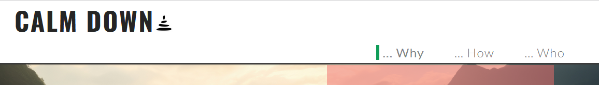

### Homepage why.html / Welcome and introduction
The homepage shows a hero image that indicates what this site is about: meditation and finding peace. Below the hero image there is text and motivative reasons why the user should start meditating. Depeneding on the device the content adjsuted smoothly on the screen size.

Homepage
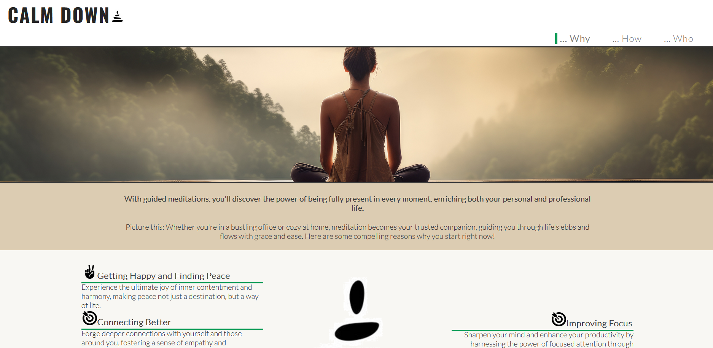

### How.html / Instructions and meditation techniques
Find here useful information to start meditating. There is a small image which remains the atmosphere of the homepage. Below you find short instructions. In addition, you find at the bottom different meditations texts and audio player. Each meditation is written down and recorded. For a better navigation there is a submenu above the meditations and anchors placed below each meditation. The anchor has to be fixed -97px and hidden due to the fix header at the top.

how.html
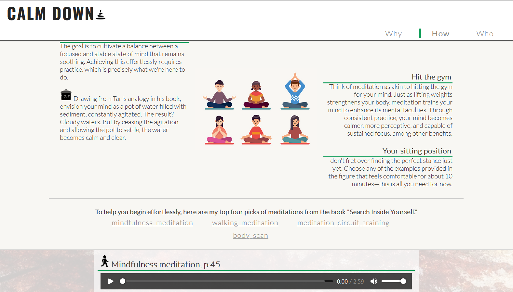

### Who.html / About authour and website creator
There is a small image which remains the atmosphere of the homepage. Displays content about author of the book 'Search Inside Yourself' and a few random information about the creator. Sections and divs are reused from previous pages.

who.html

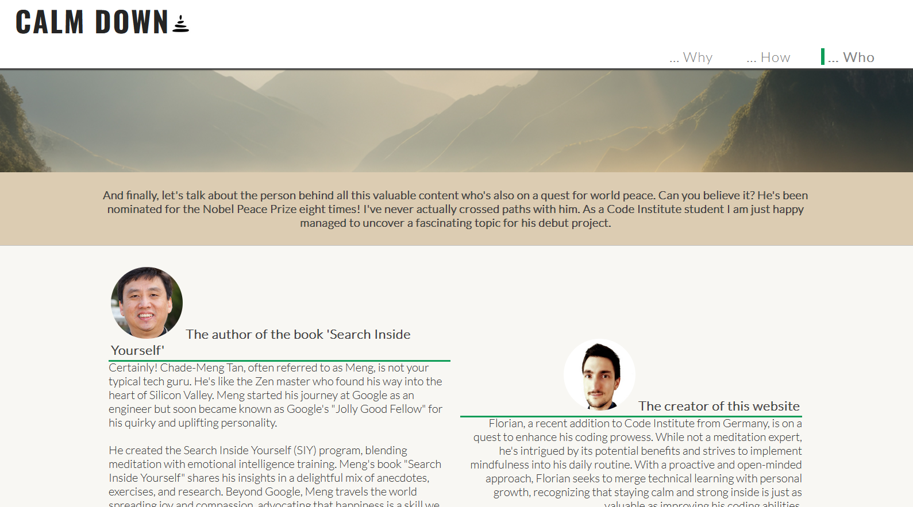

### The Footer
The footer contains a link to the creators GitHub, Linkedin and a demo Youtube link. Since the audio files are not stored on Youtube.com yet the link brings the user to the standard Youtube.com page. In case the website will go online in future the link will be replaced.

## UX Design
Plain, simple design to lead the focus of the content. Peaceful image scenary with forest and mountains are selected to calm down. The design was created as a series of wireframes covering mobile, tablet and desktop to determine the initial design and layout of the site.

### Color Scheme
The colors used are mostly bright for the background with small accents of green and black. The text color is dark grey and black to provide a userfriendly contrast.

- backgrounds #ffffff, #140b08, #f8f7f3, ##dcccb2
- accents #0f9d58 and a few black elements such as the logo and small images 
- logo, illustrations #252525, #000000
- font color #252525, #000000 #918e8e

### Typography

- I used the Google Font called 'Oswald'
- Font Awesome icons were used, for GitHub links in the footer
- further icons/ illustrations used from [Freepik.com ](https://www.freepik.com/) and [Picjumbo.com](https://picjumbo.com/)

## User Stories

### New Site Users

- As a new user, I would like to know what the site is about, so that I understand what the site does
- As a new user, I would like to access a few useful information how meditation can help me and what I have to do to start with it
- As a new user, I would like to get motivated to test meditating and I want to know what I have to do

### Returning Site Users

- As a returning user, I would like to get new motivation to keep on meditating
- As a returning user, I am coming back to hear and read to the meditations to set up a meditation routine / or keep it running.

## Wireframes
Wireframes were developed for mobile, tablet, and desktop sizes by using Balsamiq.

### Mobile Wireframes

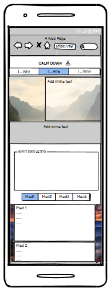

### Tablet Wireframes

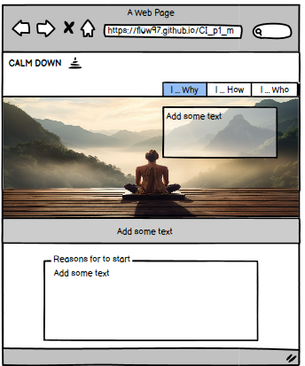
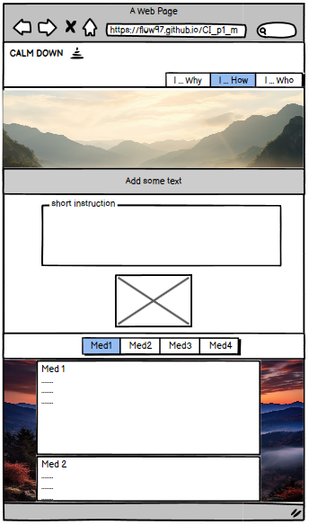

### Desktop Wireframes

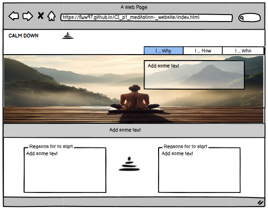
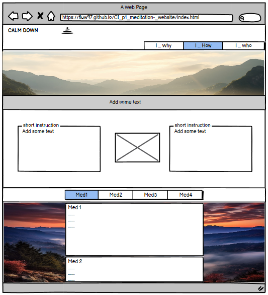

## Testing
- Testing was done in small breaks during the development and at the end of the project
- Validators have been used
- small feature checks has been made by using preview and the devtools device toolbar
- Tests are done in different browsers such as Edge, Chrome and Firefox
- Responsivness is tested with different screen sizes by using devtools device toolbar
- navigation, header and content of all subpages is readable and easy to understand
- the audio files are working, the voice is understandable and autoplay is deactivated when the page is opened

### Bugs
Some adjustment has been necessary i.e. the flex features haven't been working correctly due to wrong values. I.e. typos caused problems with css definitions.

id="menu_meditations":
Due to header fixation the anchor has to be placed to another section (more above). Same problem appears when the sub-navigation is used an the user wants to jump to i.e. the body scan meditation. The header covers the audio player, the user has to scroll up a bit. To fix this issue a hidden anchor was added.

id="logo-size":
Id selector is used multiple times, therefore the elemt type id is not valid. The elemt is transferred into a class element.

Due to a bad performance via Lighthouse the images have been compressed via [tiny.com](https://tinypng.com/)

### Validator Testing
Validator testing has been done on:

#### [HTML validator](https://validator.w3.org/)

No errors were returned

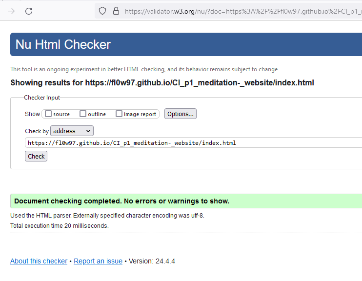

    
Subpages

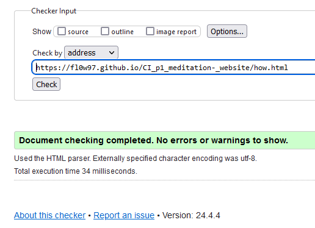

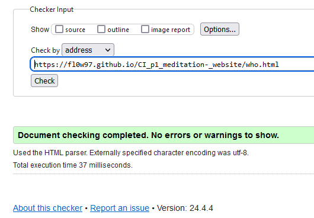

#### [CSS validator](https://jigsaw.w3.org/css-validator/)

No errors were returned

#### Accessability
I confirm that the selected colors and fonts are easy to read and accessible by using Lighthouse in devtools (Chrome).

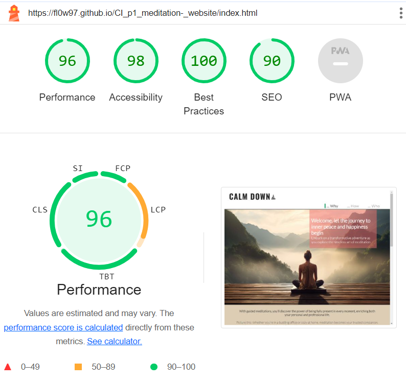

### Unfixed Bugs
No unfixed bugs.

## Deployment

The site was deployed to GitHub pages. The steps to deploy are as follows:

- In the GitHub repository, navigate to the Settings tab
- From the source section drop-down menu, select the Main Branch, then click "Save"
- The page will be automatically refreshed with a detailed ribbon display to indicate the successful deployment.

Here the live link: https://fl0w97.github.io/CI_p1_meditation-_website/index.html

    
Cloning repository

1. Visit the GitHub repository.
2. Find the Code button situated above the file list and give it a click.
3. Choose your preferred cloning method — whether it's HTTPS, SSH, or GitHub and hit the copy button to copy the URL to your clipboard.
4. Launch Git Bash or Terminal.
5. Navigate to the directory where you want the cloned directory to reside.
6. In your IDE Terminal, input the following command to clone the repository:
 git clone https://github.com/Fl0W97/CI_p1_meditation-_website.git
7. Press Enter to create your local clone.

## Tools & Technologies used

- HTML used for the main site content
- CSS used for the main site design and layout
- CSS root variables used for reusable styles throughout the site
- CSS Flexbox used for an enhanced responsive layout
- Git used for version control (git status, git add, git commit)
- GitHub used for secure online code storage
- GitHub Pages used for hosting the deployed front-end site
- Gitpod used for local IDE for development
- [Balsamiq](https://balsamiq.com/wireframes/desktop) used for creating Wireframes
- [Color generator](http://colormind.io/) used for choosing the correct HEX code
- [Favicon.io](https://favicon.io/) used to create the favicon
- [Google Fonts](https://fonts.google.com/) used to search a suitable font and using it
- [Font Awesome](https://fontawesome.com/) used for logo designs (Linkedin, Youtube and GitHub)
- [Tinypng](https://tinypng.com/) used for reducing image size

## Credits

### Media

    
icons/ illustrations and images used from [Freepik.com ](https://www.freepik.com/) and [Picjumbo.com](https://picjumbo.com/)

#### Images for reasons

- https://www.freepik.com/icon/peace_9344997
- https://www.freepik.com/icon/friend_10879075
- https://www.freepik.com/icon/target_566958
- https://www.freepik.com/icon/overwhelmed_6210111
- https://www.freepik.com/icon/pain_6210132

#### Image for meditations etc

- https://www.freepik.com/icon/boiling_2478676
- https://www.freepik.com/icon/mindfulness_11245449
- https://www.freepik.com/icon/one-man-walking_76865
- https://www.freepik.com/icon/circle-arrows_7893895
- https://www.freepik.com/icon/body-scan_10890662

#### Image hero image

- https://picjumbo.com/download=woman-meditating-on-wooden-platform-with-amazing-scenery-view-free-photo.jpg&n=woman-meditating-on-wooden-platform-with-amazing-scenery-view&id=1

#### Background image

- https://i0.wp.com/picjumbo.com/wp-content/uploads/romantic-fall-scenery-countryside-road-in-foggy-autumn-morning-free-photo.jpg?w=2210&quality=70

#### Logo Calm down

- https://www.istockphoto.com/de/vektor/abstrakte-pyramide-der-lebensbalance-suche-mit-anpassung-des-mentalen-und-gm1353485594-428574758

#### Photo of the author Chade-Meng Tan
- https://community.thriveglobal.com/wp-content/uploads/2017/08/20120201_1_0032.jpg

#### All audio files are recorded by the website creator.

### Content

- Book 'Search Inside Yourself by Chade-Meng Tan
- https://www.helpguide.org/meditations/guided-imagery-meditation.htm
- https://www.mindful.org/how-to-meditate/
- https://siyli.org/check-out-siylis-new-look/
- https://www.headspace.com/
- Support in text formulating [ChatGPT](https://chat.openai.com/) 

### Code

| Description  | Source | URL |
| ------------- | ------------- | ------------- |
| Flex:box logic for responisive navigation and content.  | Code Institute, Course Love Running Project | [https://learn.codeinstitute.net](https://learn.codeinstitute.net/courses/course-v1:CodeInstitute+LRFX101+2/courseware/e805068059af42af87681032aa64053f/7525117e5cd144daa2a7b0c57843bbee/)
| Audio feature  | w3schools  | https://www.w3schools.com/tags/tag_audio.asp
| Fix anchor | Forum Stackoverflow  | https://stackoverflow.com/questions/10732690offsetting-an-html-anchor-to-adjust-for-fixed-header
| Scroll smooth feature  | w3schools  | https://www.w3schools.com/howto/howto_css_smooth_scroll.asp
| Generate Markdown file  | GitHUb | https://docs.github.com/en/get-started/writing-on-github/getting-started-with-writing-and-formatting-on-github/basic-writing-and-formatting-syntax