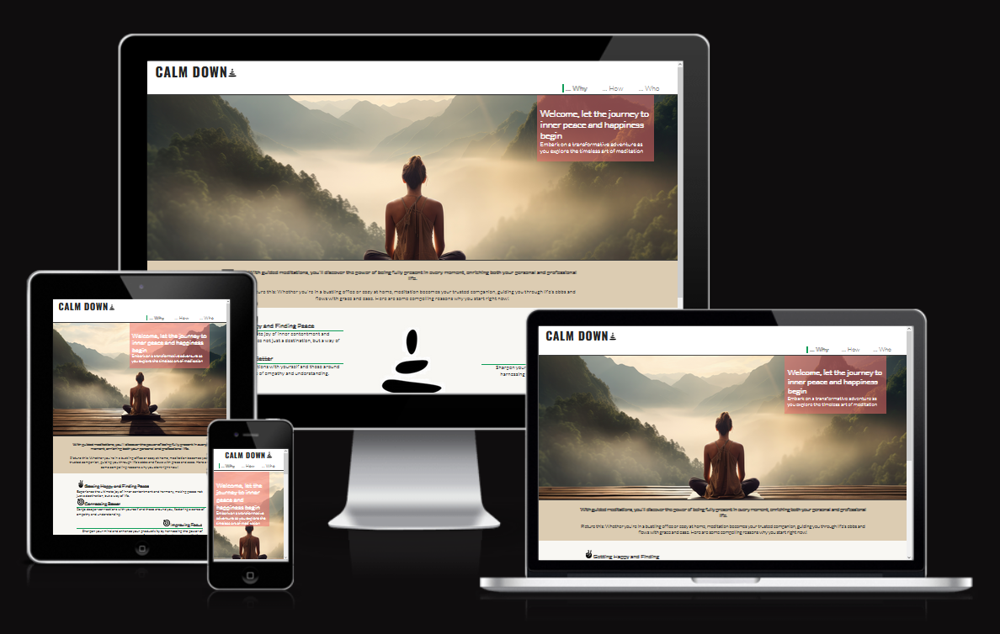
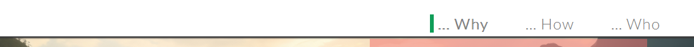
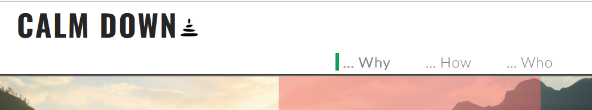
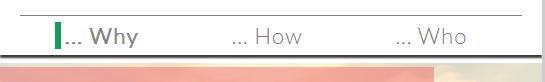
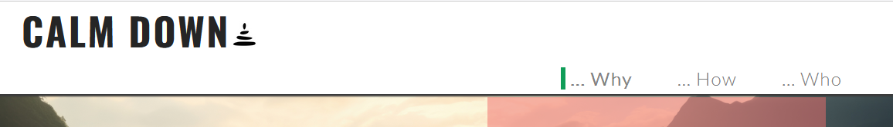
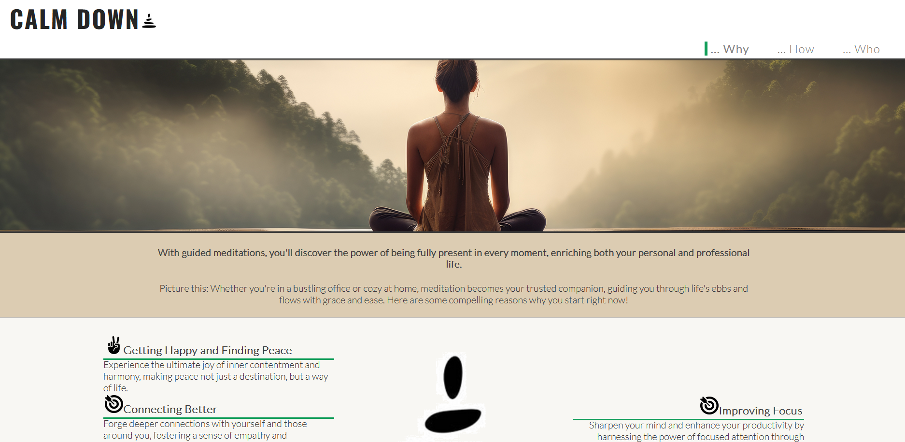
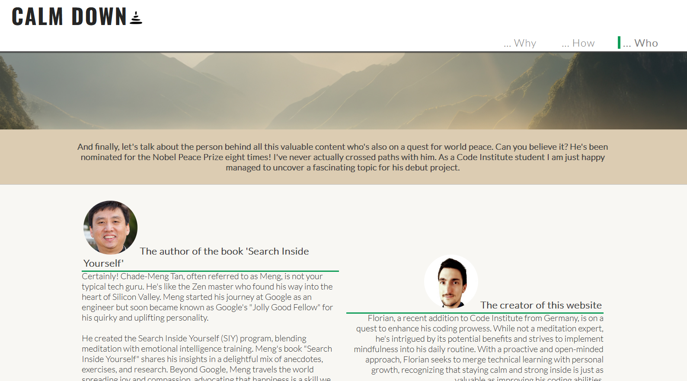
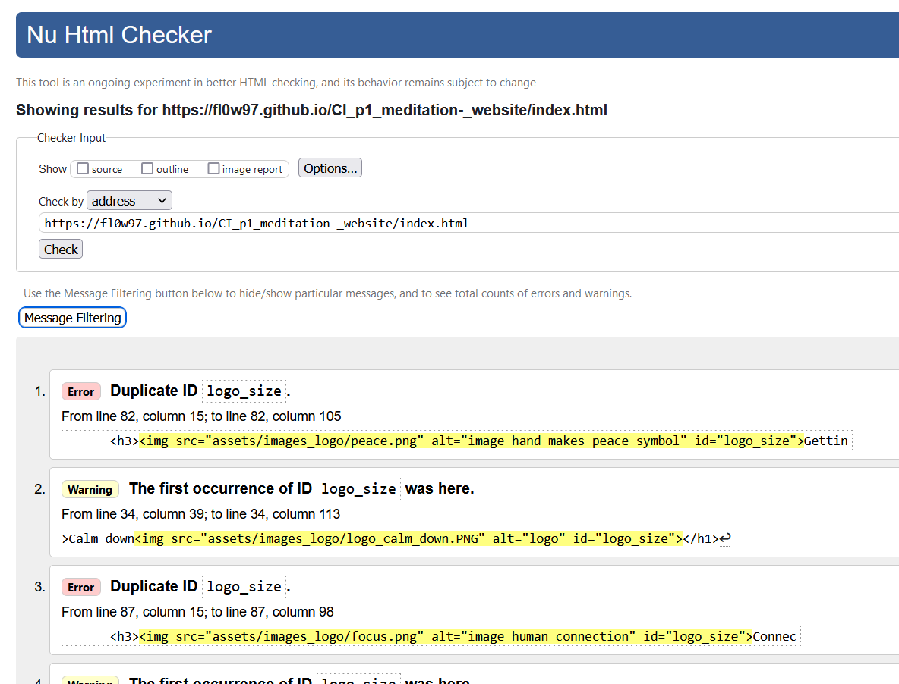

# Calm down

Welcome to my first project, the calm down website is a landing page for people how are motivated to start meditating. It offers motivation and reasons why to start meditating, a few easy meditation techniques and further links to further sources to intensivfy meditation. The content is based on the book 'Search inside yourself'.

## Features

### Navigation

The user is able to navigate on the navigation bar. There are three navigation elements according to the three pages Why, How, Who. Due to responsive design requiremets the behaviour and position of the navigation bar is slightly different.
To keep the complexity low and due to the fact that the menu elements are short, there is no toggle function for the mobile view.

Mobile view: Elements are aligned to the center. No toggle used. The width of the navigation is so small (~300px) that the content is not covered from the navigation once the screen gets smaller for mobile view. 

Tablet view: Logo on the left site, navigation elements on the right site.

Desktop view: Logo on the left site, navigation elements on the right site. However effect is implemented. 

There are three media query breakpoints used: (320px), 768px, 992px

Desktop view

Tablet view

Mobile view

### The header 
Title and logo are above the navigation. Depending on the media query the header gets bigger. The font-size/size of title and logo increases. The header's height is around 100px, therefore. there is a margin-top value of 97px on the main element.

Header

### Homepage why.html / Welcome
The homepage shows a hero image that indicates what this site is about: meditation and finding peace. Below the hero image there is text and motivative reasons why the user should start meditating. Depeneding on the device the content adjsuted smoothly on the screen size.

Homepage

### How.html / Instructions and meditation techniques
Find here useful information to start meditating. There is a small image which remains the atmosphere of the homepage. Below you find short instructions. In addition, you find at the bottom different meditations texts and audio player. Each meditation is written down and recorded. For a better navigation there is a menu above the meditations and anchors placed below each.

how.html

### Who.html / About authour and website creator
Displays content about author of the book 'Search Inside Yourself' and a few random information about the creator. Sections and divs are reused from previous pages.

who.html

## Design
change 
add freepik.com illustration for each seaction

## Testing
Testing was done in small breaks during the development. Validators have been used. In addition, for a quick check the preview and the web development feature in the browser has been used for testing.

### Bugs
Some adjustment has been necessary i.e. the flex features haven't been working correctly due to wrong values. Typos caused problems with css definitions, ...

### Validator Testing
Validator testing has been done on:

https://validator.w3.org/

https://jigsaw.w3.org/css-validator/

### Unfixed Bugs
?

## Deployment

Deployment link: https://fl0w97.github.io/CI_p1_meditation-_website/index.html

## Credits

### Media
Awesome font designs for Facebook, Youtube and Instagram logos are used
https://fontawesome.com/
https://kit.fontawesome.com/3b20d96fa9.js

Small illustrations and images are used from Freepik.com
https://www.freepik.com/search?format=search&img=1&last_filter=img&last_value=1&query=&selection=1
https://www.freepik.com/search#uuid=e32d609a-2728-482c-888c-a2f48f37a07b
https://www.freepik.com/icon/man_7118103#fromView=search&page=1&position=14&uuid=78e40cd6-31c1-4419-bb6f-f74405b905ab
https://www.freepik.com/icon/person-identify_11087997#fromView=search&page=1&position=28&uuid=405651ad-1d0c-48e0-a6f8-dcd2c157bd4f
https://www.freepik.com/icon/one-man-walking_76865
https://www.freepik.com/icon/target_566958
https://www.freepik.com/icon/boiling_2478676
https://www.freepik.com/icon/heart_10048161
https://www.freepik.com/icon/overwhelmed_6210111
https://www.freepik.com/icon/network_841262
https://www.freepik.com/icon/peace_9344997

Image hero image
https://picjumbo.com/download?d=woman-meditating-on-wooden-platform-with-amazing-scenery-view-free-photo.jpg&n=woman-meditating-on-wooden-platform-with-amazing-scenery-view&id=1

Background image
https://i0.wp.com/picjumbo.com/wp-content/uploads/romantic-fall-scenery-countryside-road-in-foggy-autumn-morning-free-photo.jpg?w=2210&quality=70

Logo Calm down
https://www.istockphoto.com/de/vektor/abstrakte-pyramide-der-lebensbalance-suche-mit-anpassung-des-mentalen-und-gm1353485594-428574758

Favicon generator
https://favicon.io/

Fonts
https://fonts.google.com/

Photos of the author:
https://community.thriveglobal.com/wp-content/uploads/2017/08/20120201_1_0032.jpg

All audio files are recorded by the website creator.

### Content
Book 'Search Inside Yourself by Chade-Meng Tan
https://www.helpguide.org/meditations/guided-imagery-meditation.htm
https://www.mindful.org/how-to-meditate/
https://siyli.org/check-out-siylis-new-look/
https://www.headspace.com/